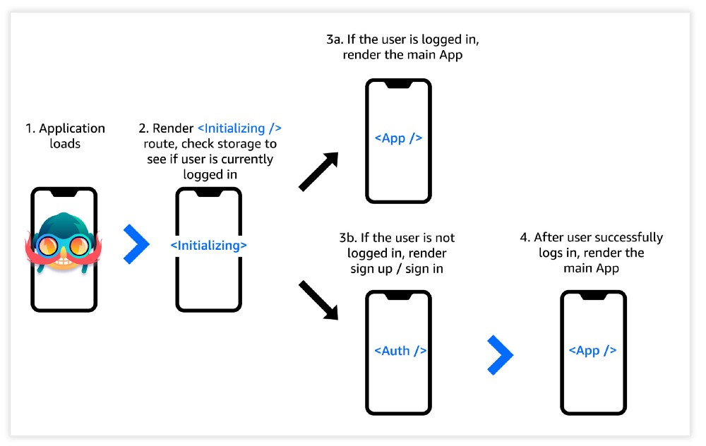

## Reference
- React Native Navigation (V2) by Wix — Getting Started
  - Part 1 — Creating end-to-end navigation & authentication flow with dummy authorization for use with any Auth provider.

  - Part 2 — Replacing dummy authentication with real authentication using Amazon Cognito.

  - https://github.com/dabit3/react-native-navigation-v2/tree/Part1

## Key points
- Real-world authentication flow
  - When the application loads we’ll render an initial Initializing component while checking to see if there is a user available in storage.
  
  - If there is a user in storage, we’ll render the Home route in a stack-based navigation.
  
  - If there is not a user in storage, we’ll render the auth components (SignIn & SignUp) in a tab-based navigation.

  

- simulating authentication state using AsyncStorage 